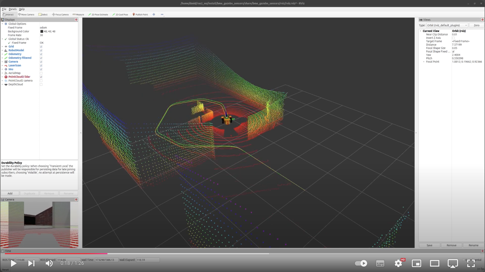
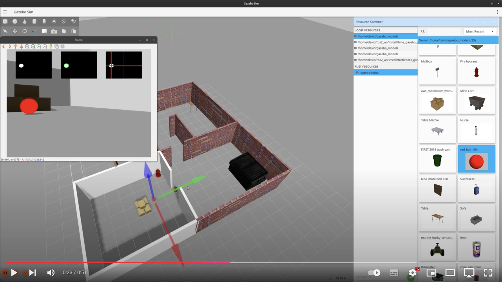

[//]: # (Image References)

[image1]: ./assets/starter-package.png "Starter package"
[image2]: ./assets/camera-first-try.png "Adding a camera"
[image3]: ./assets/camera.png "Adding a camera"
[image4]: ./assets/compressed.png "Adding a camera"
[image5]: ./assets/compressed-1.png "Adding a camera"
[image6]: ./assets/rqt-reconfigure.png "rqt reconfigure"
[image7]: ./assets/wide-angle.png "Wide angle camera"
[image8]: ./assets/wide-angle-1.png "Wide angle camera"

# Week 5-6: Gazebo sensors

## This is how far we will get by the end of this lesson: 
  <a href="https://youtu.be/0Xokl5dHRoQ"></a>  

  <a href="https://youtu.be/ELwRqeNR_NA"></a>  


# Table of Contents
1. [Introduction](#introduction)  
1.1. [Download ROS package](#download-ros-package)  
1.2. [Test the starter package](#test-the-starter-package)  
2. [Camera](#camera)  
2.1. [Image transport](#image-transport)  
2.2. [rqt reconfigure](#rqt-reconfigure)  
2.3. [Wide angle camera](#wide-angle-camera) 
3. [IMU](#imu)  
3.1. [Sensor fusion with ekf](#sensor-fusion-with-ekf)  
4. [GPS](#creating-a-gazebo-world)  
4.1. [Haversine formula](#diff-drive-plugin)  
4.2. [GPS waypoint following](#diff-drive-plugin) 
5. [Lidar](#urdf)  
5.1. [3D lidar](#diff-drive-plugin) 
6. [RGBD camera](#gazebo-integration)  
7. [Image processing with OpenCV](#3d-models)  


# Introduction

After we built a simulated robot that we can drive around manually, we'll start adding various types of sensors to it. We'll see how to improve the odometry with sensor fusion using an IMI, how to follow GPS waypoints and we'll use various cameras and lidars.

## Download ROS package

The starting package of this lesson is very similar to where we just finished in the previous lesson, but don't forget that every lesson has its own starter package that you can donwload from GitHub. To download the starter package clone the following git repo with the `starter-branch` (using the `-b branch` flag) to your colcon workspace:
```bash
git clone -b starter-branch https://github.com/MOGI-ROS/Week-5-6-Gazebo-sensors.git
```

As we saw prevoiusly we can take a look what's inside the `bme_gazebo_sensors` package with the `tree` command!

```bash
.
├── CMakeLists.txt
├── package.xml
├── config
│   └── ekf.yaml
├── launch
│   ├── check_urdf.launch.py
│   ├── spawn_robot.launch.py
│   └── world.launch.py
├── meshes
│   ├── lidar.dae
│   ├── mogi_bot.dae
│   └── wheel.dae
├── rviz
│   ├── gps.rviz
│   ├── rviz.rviz
│   └── urdf.rviz
├── urdf
│   ├── materials.xacro
│   ├── mogi_bot.gazebo
│   └── mogi_bot.urdf
└── worlds
    ├── empty.sdf
    ├── home.sdf
    └── world.sdf
```

Let's see what will we do with the existing files and folders:
- `config`: We usually store parameters and large configuration files for ROS packages which aren't comfortable to handle from the launchfiles directly. In this lesson we store the configuration file for the sensor fusion using the `robot_localization` package's Extended Kalman Filter.
- `launch`: Default launch files are already part of the starting package, we can test the package with `spawn_robot.launch.py`.
- `meshes`: this folder contains the 3D models in `dae` format (collada mesh) that we use for our robot's body, wheels and lidar sensor.
- `rviz`: Pre-configured RViz2 layouts
- `urdf`: The URDF models of our robot, we'll extend the `mogi_bot.urdf` and `gazebo` files through this lesson
- `worlds`: default Gazebo worlds that we'll use in the simulations.


## Test the starter package

After we downloaded the `starter-branch` from GitHub, let's rebuild the workspace and source the `install/setup.bash` file to make sure ROS and its tools are aware about the new package.

Then we can test the package with the usual launch file:
```bash
ros2 launch bme_gazebo_sensors spawn_robot.launch.py
```

And we can also start a teleop node:
```bash
ros2 run teleop_twist_keyboard teleop_twist_keyboard
```

![alt text][image1]


# Camera

To add a camera - and every other sensors later - we have to change 2 files:
1) The `mogi_bot.urdf`: we have to define the position, orientation and other physical properties of the camera in this file. This is not necessarily simulation dependent, we have to do these same changes in the urdf in case of a real robot with a real sensor.
2) The `mogi_bot.gazebo`: this is fully simulation dependent, we have to define the properties of the simulated camera in this file.

Let's add the camera first to the `mogi_bot.urdf`:

```xml
  <!-- STEP 7 - Camera -->
  <joint type="fixed" name="camera_joint">
    <origin xyz="0.225 0 0.075" rpy="0 0 0"/>
    <child link="camera_link"/>
    <parent link="base_link"/>
    <axis xyz="0 1 0" />
  </joint>

  <link name='camera_link'>
    <pose>0 0 0 0 0 0</pose>
    <inertial>
      <mass value="0.1"/>
      <origin xyz="0 0 0" rpy="0 0 0"/>
      <inertia
          ixx="1e-6" ixy="0" ixz="0"
          iyy="1e-6" iyz="0"
          izz="1e-6"
      />
    </inertial>

    <collision name='collision'>
      <origin xyz="0 0 0" rpy="0 0 0"/> 
      <geometry>
        <box size=".03 .03 .03"/>
      </geometry>
    </collision>

    <visual name='camera_link_visual'>
      <origin xyz="0 0 0" rpy="0 0 0"/>
      <geometry>
        <box size=".03 .03 .03"/>
      </geometry>
    </visual>

  </link>

  <gazebo reference="camera_link">
    <material>Gazebo/Red</material>
  </gazebo>

  <joint type="fixed" name="camera_optical_joint">
    <origin xyz="0 0 0" rpy="-1.5707 0 -1.5707"/>
    <child link="camera_link_optical"/>
    <parent link="camera_link"/>
  </joint>

  <link name="camera_link_optical">
  </link>
```

As we see above, the camera is a 3 x 3 x 3 cm cube, attached to the `base_link` with a fixed joint. But there is another thing, `camera_link_optical` which is connected to the `camera_link` through the `camera_optical_joint`! The purpose of this additional link and joint to solve the conflict between 2 different conventional coordinate systems:
- By default, URDF uses the right-handed coordinate system with X forward, Y left, and Z up.
- However, many ROS drivers and vision processing pipelines expect a camera’s optical axis to be aligned with Z forward, X to the right, and Y down.

`camera_optical_joint` applies a static rotation so that the camera data will be interpreted correctly by ROS tools that assume the Z-forward convention for image and depth sensors.

Now let's add the simulated camera into `mogi_bot.gazebo`:

```xml
  <gazebo reference="camera_link">
    <sensor name="camera" type="camera">
      <camera>
        <horizontal_fov>1.3962634</horizontal_fov>
        <image>
          <width>640</width>
          <height>480</height>
          <format>R8G8B8</format>
        </image>
        <clip>
          <near>0.1</near>
          <far>15</far>
        </clip>
        <noise>
          <type>gaussian</type>
          <!-- Noise is sampled independently per pixel on each frame.
               That pixel's noise value is added to each of its color
               channels, which at that point lie in the range [0,1]. -->
          <mean>0.0</mean>
          <stddev>0.007</stddev>
        </noise>
        <optical_frame_id>camera_link_optical</optical_frame_id>
        <camera_info_topic>camera/camera_info</camera_info_topic>
      </camera>
      <always_on>1</always_on>
      <update_rate>20</update_rate>
      <visualize>true</visualize>
      <topic>camera/image</topic>
    </sensor>
  </gazebo>
```

> Don't forget that the above code snippets must be placed within the already existing `<robot>` tag!

With the above plugin we define a couple of things for Gazebo, let's see the important ones one by one:
- `<gazebo reference="camera_link">`, we have to refer to the `camera_link` that we defined in the `urdf`
- `<horizontal_fov>1.3962634</horizontal_fov>`, the field of view of the simulated camera
- `width`, `height`, `format` and `update_rate`, properties of the video stream
- `<optical_frame_id>camera_link_optical</optical_frame_id>`, we have to use the `camera_link_optical` that we checked in details above to ensure the right static transformations between the coordinate systems
- `<camera_info_topic>camera/camera_info</camera_info_topic>`, certain tools like rviz requires a `camera_info` topic that describes the physical properties of the camera. The topic's name must match camera's topic (in this case both are `camera/...`)
- `<topic>camera/image</topic>`, we define the camera topic here

We can rebuild the workspace and try our changes, but it will not yet work. The camera's red cube model is visible but the topics aren't available for ROS (we can check it for example with `rqt`)

![alt text][image2]

With the new Gazebo simulator topics are not automatically forwarded as we already saw it in the previous lesson, we have to use the `parameter_bridge` of the `ros_gz_bridge` package. It has [a very detailed readme](https://github.com/gazebosim/ros_gz/tree/ros2/ros_gz_bridge) what kind of topic types can be forwarded between ROS and Gazebo. We have to extend the arguments of the `parameter_bridge` in our launch file:

```python
    # Node to bridge /cmd_vel and /odom
    gz_bridge_node = Node(
        package="ros_gz_bridge",
        executable="parameter_bridge",
        arguments=[
            "/clock@rosgraph_msgs/msg/Clock[gz.msgs.Clock",
            "/cmd_vel@geometry_msgs/msg/Twist@gz.msgs.Twist",
            "/odom@nav_msgs/msg/Odometry@gz.msgs.Odometry",
            "/joint_states@sensor_msgs/msg/JointState@gz.msgs.Model",
            "/tf@tf2_msgs/msg/TFMessage@gz.msgs.Pose_V",
            "/camera/image@sensor_msgs/msg/Image@gz.msgs.Image",
            "/camera/camera_info@sensor_msgs/msg/CameraInfo@gz.msgs.CameraInfo",

        ],
        output="screen",
        parameters=[
            {'use_sim_time': LaunchConfiguration('use_sim_time')},
        ]
    )
```

Let's rebuild the workspace and try it again:

```bash
ros2 launch bme_gazebo_sensors spawn_robot.launch.py
```

![alt text][image3]

## Image transport

We can see that both `/camera/camera_info` and `/camera/image` topics are forwarded. Although this is still not the ideal way to forward the camera image from Gazebo. ROS has a very handy feature with it's image transport protocol plugins, it's able to automatically compress the video stream in the background without any additional work on our side. But this feature doesn't work together with `parameter_bridge`. Without compression the 640x480 camera stream consumes almost 20 MB/s network bandwith which is unacceptable for a wireless mobile robot.

Therefore there is a dedicated `image_bridge` node in the `ros_gz_image` package. Let's modify our launch file to the following:

```python
    # Node to bridge /cmd_vel and /odom
    gz_bridge_node = Node(
        package="ros_gz_bridge",
        executable="parameter_bridge",
        arguments=[
            "/clock@rosgraph_msgs/msg/Clock[gz.msgs.Clock",
            "/cmd_vel@geometry_msgs/msg/Twist@gz.msgs.Twist",
            "/odom@nav_msgs/msg/Odometry@gz.msgs.Odometry",
            "/joint_states@sensor_msgs/msg/JointState@gz.msgs.Model",
            "/tf@tf2_msgs/msg/TFMessage@gz.msgs.Pose_V",
            #"/camera/image@sensor_msgs/msg/Image@gz.msgs.Image",
            "/camera/camera_info@sensor_msgs/msg/CameraInfo@gz.msgs.CameraInfo",

        ],
        output="screen",
        parameters=[
            {'use_sim_time': LaunchConfiguration('use_sim_time')},
        ]
    )

    # Node to bridge camera image with image_transport and compressed_image_transport
    gz_image_bridge_node = Node(
        package="ros_gz_image",
        executable="image_bridge",
        arguments=[
            "/camera/image",
        ],
        output="screen",
        parameters=[
            {'use_sim_time': LaunchConfiguration('use_sim_time'),
             'camera.image.compressed.jpeg_quality': 75},
        ],
    )
```

We also have to add the new node to the `launchDescription`:

```python
launchDescriptionObject.add_action(gz_image_bridge_node)
```

After rebuild we can try it using `rqt` and we will see huge improvement in the bandwith thanks to the `jpeg` compression.
![alt text][image4]

> If compressed images are not visible in rqt, you have to install the plugins you want to use:
> - `sudo apt install ros-jazzy-compressed-image-transport`: for jpeg and png compression
> - `sudo apt install ros-jazzy-theora-image-transport`: for theora compression
> - `sudo apt install ros-jazzy-zstd-image-transport`: for zstd compression

But we face another issue, this time in RViz, the uncompressed camera stream is visible as before but the compressed one isn't due to the following warning:

```
Camera Info
Expecting Camera Info on topic [/camera/image/camera_info]. No CameraInfo received. Topic may not exist.
```

It's because RViz always expect the `image` and `the camera_info` topics with the same prefix which works well for:

`/camera/image` &#8594; `/camera/camera_info`

But doesn't work for:

`/camera/image/compressed` &#8594; `/camera/image/camera_info`

because we don't publish the `camera_info` to that topic. We could remap the `camera_info` to that topic, but then the uncompressed image won't work in RViz, so it's not the desired solution.

But there is another useful tool that we can use, the `relay` node from the `topic_tools` package:

```python
    # Relay node to republish /camera/camera_info to /camera/image/camera_info
    relay_camera_info_node = Node(
        package='topic_tools',
        executable='relay',
        name='relay_camera_info',
        output='screen',
        arguments=['camera/camera_info', 'camera/image/camera_info'],
        parameters=[
            {'use_sim_time': LaunchConfiguration('use_sim_time')},
        ]
    )
```

Of course, don't forget to add it to the `launchDescription` too:
```python
launchDescriptionObject.add_action(relay_camera_info_node)
```

> If `topic_tools` is not installed you can install it with `sudo apt install ros-jazzy-topic-tools`

Rebuild the workspace and let's try it!

```bash
ros2 launch bme_gazebo_sensors spawn_robot.launch.py
```
![alt text][image5]

## rqt reconfigure

We already set up the `jpeg` quality in the `image_bridge` node with the following parameter:
```python
'camera.image.compressed.jpeg_quality': 75
```

But how do we know what is the name of the parameter and what other settings do we can change? To see that we will use the `rqt_reconfigure` node.

First start the simulation:
```bash
ros2 launch bme_gazebo_sensors spawn_robot.launch.py
```

Then start rqt_reconfigure:
```bash
ros2 run rqt_reconfigure rqt_reconfigure
```

![alt text][image6]

We can play with the parameters here, change the compression or the algorithm as we wish and we can monitor it's impact with `rqt`.

## Wide angle camera

Using wide angle or fisheye lens on mobile robots is quite common, but With the conventional camera simulation we cannot simply increase the field of view to get a wide angle distortion. To achieve this we need a different plugin, the `wideangle_camera`. Let's replace the camera simulation in the `mogi_bot.gazebo` to this one:

```xml
  <gazebo reference="camera_link">
    <sensor name="wideangle_camera" type="wideanglecamera">
      <camera>
        <horizontal_fov>3.14</horizontal_fov>
        <image>
          <width>640</width>
          <height>480</height>
        </image>
        <clip>
          <near>0.1</near>
          <far>15</far>
        </clip>
        <optical_frame_id>camera_link_optical</optical_frame_id>
        <camera_info_topic>camera/camera_info</camera_info_topic>
      </camera>
      <always_on>1</always_on>
      <update_rate>20</update_rate>
      <topic>camera/image</topic>
      <gz_frame_id>camera_link</gz_frame_id>
    </sensor>
  </gazebo>
```

After rebuilding the workspace we can try it out:

```bash
ros2 launch bme_gazebo_sensors spawn_robot.launch.py
```

![alt text][image7]

As image it works in both `rviz` and in `rqt` but as a camera it doesn't work in RViz due to the following error:
```bash
[rviz2-2] [INFO] [1736112172.091762692] [rviz]: Message Filter dropping message: frame 'mogi_bot/base_footprint/wideangle_camera' at time 137.352 for reason 'discarding message because the queue is full'
```

As of ROS2 Jazzy and Gazebo Harmonic `wideangle_camera` has a bug and it ignores the `optical_frame_id` tag therefore RViz rejects visualizing it, we can also take a look on the header of the image topic:

![alt text][image8]

If we want to fix this problem we can re-publish the message with a corrected header, I created a very simply script that does this, it's part of the starter package and we can run the node with the following command:

```bash
ros2 run bme_gazebo_sensors_py image_republisher
```


# IMU


sudo apt install ros-jazzy-rviz-imu-plugin

WORLD plugin!!!!

## Sensor fusion with ekf

EKF:
sudo apt install ros-jazzy-robot-localization

To see who is the publisher:
ros2 topic info /odom --verbose

---


sudo apt install ros-jazzy-rviz-satellite


GZ examples:
https://github.com/gazebosim/gz-sim/tree/gz-sim8/examples/worlds


SDF reference:
http://sdformat.org/spec?elem=sensor&ver=1.6


GPS:

OpenStreetMap
https://www.openstreetmap.org/search?lat=47.479099&lon=19.057811


sudo apt install ros-jazzy-rviz-satellite
https://github.com/nobleo/rviz_satellite

WORLD plugin!!!!

sudo apt install ros-jazzy-tf-transformations

ros2 launch bme_gazebo_sensors spawn_robot.launch.py world:=empty.sdf rviz_config:=gps.rviz x:=0.0 y:=0.0 yaw:=0.0


Reload URDF:

david@david-ubuntu24:~$ ros2 param set /robot_state_publisher robot_description "$(xacro $(ros2 pkg prefix bme_gazebo_sensors)/share/bme_gazebo_sensors/urdf/mogi_bot.urdf)"
Set parameter successful

OpenCV

sudo apt install ros-jazzy-cv-bridge

